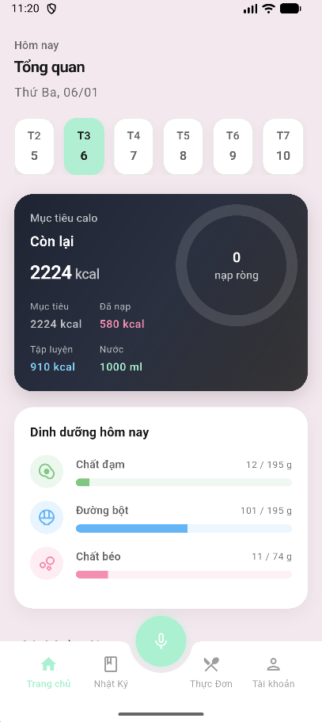
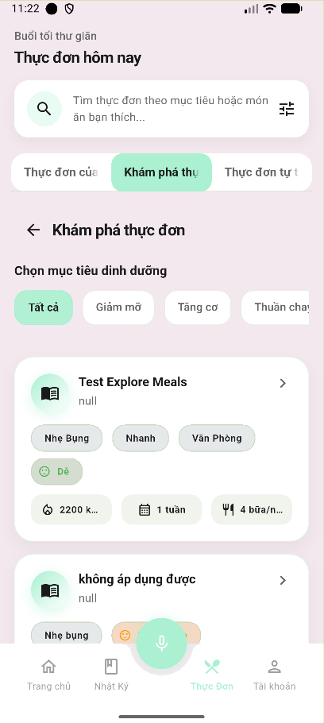
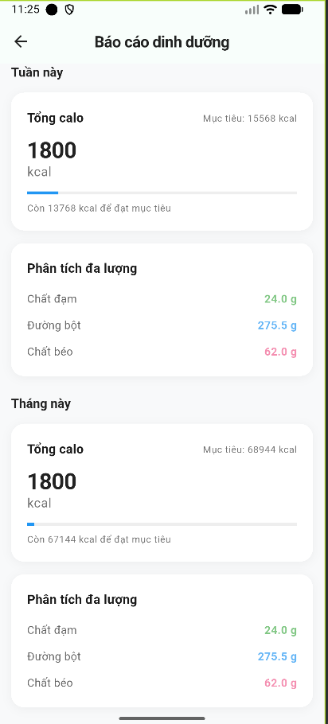

# Calories App

<div align="center">


**A production-grade Flutter application for comprehensive calorie tracking, meal planning, and nutrition management**

[Features](#-key-features) • [Architecture](#-architecture) • [Getting Started](#-getting-started) • [Tech Stack](#-tech-stack)

</div>

---

## Overview

Calories App is a sophisticated mobile application designed to help users track daily nutrition, manage meal plans, and achieve health goals. Built with Clean Architecture and Domain-Driven Design principles, the application demonstrates enterprise-level software engineering practices with strict separation of concerns, testable business logic, and a scalable architecture that supports both online and offline functionality.

The project has undergone multiple refactoring phases to achieve a mature, maintainable codebase that adheres to SOLID principles. Business logic is completely isolated from UI and infrastructure concerns, making the codebase highly testable and adaptable to changing requirements.

## Key Features

### Core Features

- **Daily Calorie Tracking** - Track food consumption and exercise with real-time calorie calculations
- **Meal Planning** - Create custom meal plans or explore curated templates
- **Diary Management** - Log meals and exercises with automatic meal type classification
- **Voice Input** - Add foods to your diary using voice recognition powered by Google Gemini AI
- **Exercise Logging** - Track workouts and activities with calorie burn calculations
- **Statistics & Reports** - View detailed nutrition summaries and progress analytics
- **Water & Weight Tracking** - Monitor hydration and body weight over time
- **Smart Notifications** - Receive reminders for meals and hydration goals
- **Health Connect Integration** - Sync step data from Android Health Connect
- **User Profiles** - Personalized profiles with TDEE calculations and goal setting
- **Secure Authentication** - Firebase Authentication with Google Sign-In support

### Engineering Features

- **Clean Architecture** - Strict layered architecture with clear boundaries
- **Domain-Driven Design** - Business logic drives the architecture
- **Hybrid Cache-First** - Instant loading with offline support
- **Real-time Sync** - Firestore real-time updates with optimistic UI
- **Testable Design** - Pure domain logic with mockable interfaces
- **Offline Support** - Full functionality without network connectivity
- **Type Safety** - Full null-safety and strong typing
- **Comprehensive Documentation** - Inline documentation and architecture guides

## Screenshots

> **Note:** Screenshots should be placed in `docs/screenshots/` directory.

<!--





-->

## Architecture

### Clean Architecture & Domain-Driven Design

The application follows a strict layered architecture that enforces separation of concerns:

```
┌─────────────────────────────────────────────┐
│         Presentation Layer                  │
│    (UI, Widgets, Riverpod Providers)        │
│         └── Depends on ──┐                  │
└──────────────────────────┼──────────────────┘
                           │
┌──────────────────────────▼──────────────────┐
│        Application Layer                    │
│   (Services, Use Cases, Controllers)        │
│         └── Depends on ──┐                  │
└──────────────────────────┼──────────────────┘
                           │
┌──────────────────────────▼──────────────────┐
│          Domain Layer                       │
│  (Entities, Repository Interfaces)          │
│    Pure Dart - No Flutter/Firebase          │
│         └── Depends on ──┐                  │
└──────────────────────────┼──────────────────┘
                           │
┌──────────────────────────▼──────────────────┐
│           Data Layer                        │
│    (DTOs, Firestore, Cache)                 │
└─────────────────────────────────────────────┘
```

#### Layer Responsibilities

**Domain Layer** (`lib/domain/`)
- Pure Dart entities with no external dependencies
- Abstract repository interfaces defining contracts
- Business logic services that coordinate between repositories and caches
- Domain models completely isolated from infrastructure concerns

**Data Layer** (`lib/data/`)
- DTOs (Data Transfer Objects) for Firestore schema mapping
- Firestore repository implementations
- SharedPreferences cache implementations
- Handles all data persistence and external API communication

**Application Layer** (`lib/features/*/application/`)
- Business logic services that orchestrate domain operations
- Coordinates between repositories and caches
- Implements use cases and application-specific workflows

**Presentation Layer** (`lib/features/*/presentation/`)
- Flutter UI widgets and screens
- Riverpod providers for state management
- Controllers that manage UI state and user interactions
- Completely decoupled from business logic

### Hybrid Cache-First Architecture

The application implements a sophisticated caching strategy:

1. **Instant Loading** - Data loads from local cache immediately
2. **Background Sync** - Firestore updates happen asynchronously
3. **Offline Support** - Full functionality without network connectivity
4. **Cache Invalidation** - Smart cache management ensures data consistency

Services implement cache-first patterns where cached data is emitted immediately, followed by background Firestore synchronization and cache updates.

## Project Structure

```
lib/
├── app/                    # App-level configuration and routing
│   ├── config/            # Firebase configuration
│   └── routing/           # Navigation gates and guards
│
├── core/                   # Core functionality
│   ├── health/            # Health Connect integration
│   ├── notifications/     # Push and local notifications
│   ├── theme/             # App theming
│   └── utils/             # Utility functions
│
├── domain/                 # Domain layer (Pure Dart)
│   ├── activities/        # Activity domain models
│   ├── diary/             # Diary domain models and services
│   ├── foods/             # Food catalog domain models
│   ├── meal_plans/        # Meal plan domain models
│   └── profile/           # User profile domain models
│
├── data/                   # Data layer (Infrastructure)
│   ├── activities/        # Activity DTOs and repositories
│   ├── diary/             # Diary DTOs and Firestore repositories
│   ├── foods/             # Food DTOs and repositories
│   ├── meal_plans/        # Meal plan DTOs and repositories
│   └── profile/           # Profile DTOs and repositories
│
├── features/               # Feature modules (Presentation)
│   ├── auth/              # Authentication screens
│   ├── diary/             # Diary feature domain services
│   ├── exercise/          # Exercise tracking
│   ├── foods/             # Food management
│   ├── home/              # Dashboard and main screens
│   ├── meal_plans/        # Meal plan management
│   ├── onboarding/        # User onboarding flow
│   ├── settings/          # App settings
│   └── voice_input/       # Voice input feature
│       ├── application/   # Voice service layer
│       ├── data/          # Gemini API integration
│       ├── domain/        # Voice domain entities
│       └── presentation/  # Voice UI and controllers
│
└── shared/                 # Shared utilities and providers
    ├── config/            # Shared configuration
    ├── state/             # Shared Riverpod providers
    └── utils/             # Shared utilities
```

## Tech Stack

| Category | Technology | Version | Purpose |
|----------|-----------|---------|---------|
| **Framework** | Flutter | 3.38.5 | Cross-platform UI framework |
| **Language** | Dart | 3.5.0 | Programming language |
| **State Management** | Riverpod | 3.0.3 | Reactive state management |
| **Backend** | Firebase | - | Backend-as-a-Service |
| **Authentication** | Firebase Auth | 5.3.1 | User authentication |
| **Database** | Cloud Firestore | 5.4.4 | NoSQL document database |
| **Storage** | Firebase Storage | 12.0.0 | File and image storage |
| **Analytics** | Firebase Analytics | 11.3.3 | Usage analytics |
| **Notifications** | FCM + Local | 15.2.10 | Push and local notifications |
| **App Check** | Firebase App Check | 0.3.0+1 | API abuse prevention |
| **AI/ML** | Google Gemini API | - | Voice input processing |
| **Health Data** | Health Connect | 13.1.4 | Android health data integration |
| **Caching** | SharedPreferences | 2.3.2 | Local data persistence |
| **Environment** | flutter_dotenv | 5.1.0 | Environment variable management |
| **Speech** | speech_to_text | 7.0.0 | Voice recognition |

## Getting Started

### Prerequisites

- Flutter SDK 3.38.5 or higher
- Dart SDK 3.5.0 or higher
- Android Studio / Xcode for mobile development
- Firebase project with required services enabled
- Google Gemini API key (for voice input feature)

### Installation

1. **Clone the repository**
   ```bash
   git clone <repository-url>
   cd Calories-App
   ```

2. **Install dependencies**
   ```bash
   flutter pub get
   ```

3. **Set up environment variables** (see [Environment & Secrets](#-environment--secrets))

4. **Run the application**
   ```bash
   flutter run
   ```

## Environment & Secrets

The application requires environment variables for API keys and configuration. These are managed through a `.env` file that is excluded from version control for security.

### Required Environment Variables

Create a `.env` file in the project root:

```env
GEMINI_API_KEY=your_gemini_api_key_here
```

### Security Notes

- The `.env` file is gitignored and should never be committed
- For CI/CD, environment variables are injected via GitHub Secrets
- See `docs/ANDROID_SIGNING_SECRETS.md` for production build secrets setup

## Firebase Setup

### Required Firebase Services

The application uses the following Firebase services:

- **Authentication** - Email/password and Google Sign-In
- **Cloud Firestore** - Document database with offline persistence
- **Cloud Storage** - User profile image storage
- **Cloud Messaging** - Push notifications
- **Firebase Analytics** - Usage analytics
- **App Check** - API abuse prevention (Play Integrity for Android)

### Setup Steps

1. **Create a Firebase project** at [Firebase Console](https://console.firebase.google.com/)

2. **Enable required services:**
   - Authentication (Email/Password, Google Sign-In)
   - Cloud Firestore (create database in production mode)
   - Cloud Storage (set up storage bucket)
   - Cloud Messaging (enable FCM)
   - Firebase Analytics (automatically enabled)
   - App Check (configure Play Integrity for Android)

3. **Configure Android:**
   - Download `google-services.json` from Firebase Console
   - Place it in `android/app/`
   - Update `android/app/build.gradle` if needed

4. **Configure iOS:**
   - Download `GoogleService-Info.plist` from Firebase Console
   - Add it to `ios/Runner/` in Xcode
   - Update iOS configuration as needed

5. **Update Firebase configuration:**
   - The app uses `lib/app/config/firebase_options.dart`
   - Regenerate if needed using FlutterFire CLI: `flutterfire configure`

## Testing Strategy

The architecture is designed for testability with clear separation of concerns:

### Test Structure

```
test/
├── features/
│   └── meal_plans/
│       ├── domain/services/    # Domain service tests
│       └── data/               # Repository tests
└── services/                   # Utility service tests
```

### Testing Philosophy

- **Domain Layer**: Pure Dart code can be unit tested without Flutter dependencies
- **Repository Interfaces**: Mock implementations enable isolated testing
- **Service Layer**: Business logic can be tested independently of UI and infrastructure
- **Test Coverage**: Focus on domain logic and critical business workflows

### Running Tests

```bash
# Run all tests
flutter test

# Run tests with coverage
flutter test --coverage

# Run specific test file
flutter test test/features/meal_plans/domain/services/kcal_calculator_test.dart
```

## CI/CD Overview

The project implements a professional continuous integration and continuous deployment pipeline using GitHub Actions.

### Continuous Integration (CI)

All Pull Requests to `main` or `master` are automatically validated through a CI pipeline that:

- Runs Flutter static analysis (`flutter analyze`)
- Executes the full test suite (`flutter test`)
- Verifies Android debug builds succeed
- Ensures code quality standards are met before merge

CI checks must pass before any PR can be merged, maintaining code quality and preventing regressions.

### Continuous Deployment (CD)

After code is merged to the main branch, the release workflow automatically:

- Builds signed Android App Bundles (AAB) for Google Play distribution
- Generates signed APK artifacts for testing
- Uploads release artifacts for download
- Ensures production-ready builds are available immediately after merge

The CD pipeline uses secure secret management to handle signing credentials and API keys without exposing sensitive information in the repository.

For detailed setup instructions, see `docs/ANDROID_SIGNING_SECRETS.md`.

## Roadmap

### Planned Features

- Advanced meal plan templates with AI recommendations
- Barcode scanning for food entry
- Enhanced analytics and insights dashboard
- Meal prep planning and shopping lists
- Social features for sharing meal plans
- Integration with additional health platforms
- Multi-language support expansion

### Technical Improvements

- Complete migration of legacy code to DDD architecture
- Expanded test coverage for domain and application layers
- Performance optimizations for large datasets
- Enhanced offline synchronization strategies
- Advanced caching strategies with TTL management

## Contributing

We welcome contributions that align with the project's architecture and coding standards. Please review our contribution guidelines before submitting changes.

For detailed information on:
- Development workflow and branching strategy
- Code review process
- Testing requirements
- Architecture rules and patterns

See **[CONTRIBUTING.md](docs/CONTRIBUTING.md)** for complete guidelines.

### Key Principles

- Follow Clean Architecture and Domain-Driven Design patterns
- Maintain strict layer separation (Domain must remain pure Dart)
- Include appropriate tests for new features
- Update documentation as needed
- Ensure all CI checks pass before requesting review

## License

This project is developed for academic purposes. All rights reserved.

## Author

**QuocTuan_dev_in_hcm**

- LinkedIn: [www.linkedin.com/in/tuấn-quốc-866a63251](https://www.linkedin.com/in/tuấn-quốc-866a63251)
- Email: tuquoctuan201@gmail.com
---

<div align="center">

**Built with Flutter and Firebase**

Developed as part of academic coursework with a focus on software engineering best practices, Clean Architecture, and Domain-Driven Design.

[⬆ Back to Top](#calories-app)

</div>
